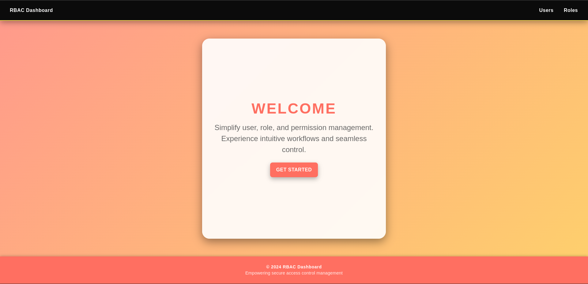
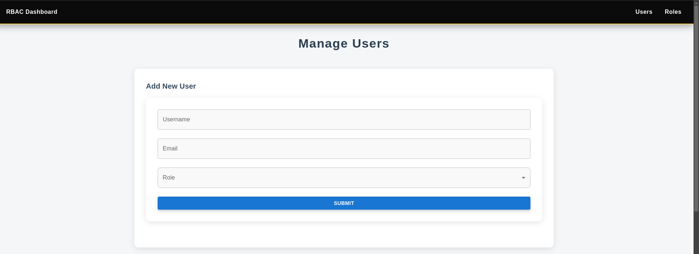
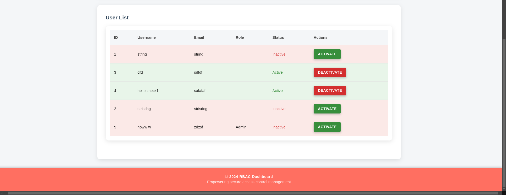
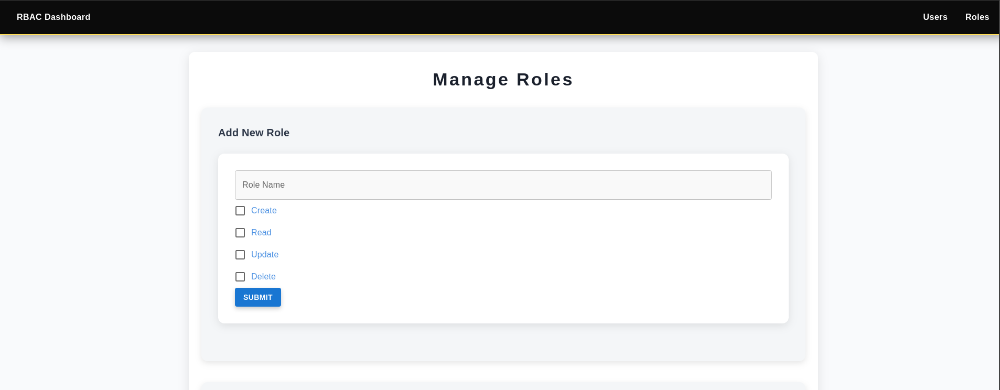
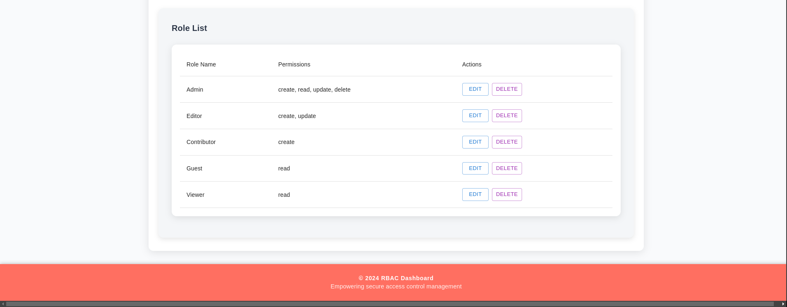

 # RBAC
## Deployed link : https://rbac-vp6p.vercel.app/
 
The Role-Based Access Control (RBAC) project manages user roles and their associated permissions efficiently.
## Key Features:
- *Role Management:* View and manage roles, each with permissions like Create, Read, Update, and Delete.
- *Edit Roles:* Admins can update role names and adjust permissions using an intuitive dialog.
- *CRUD Operations:* Ability to create, update, and delete roles with real-time updates.

## Technologies Used:
- *Backend:* Built with FastAPI for the API, Alembic for database migrations, and PostgreSQL for data storage.
- *Frontend:* React with Material-UI for the user interface, and axios for handling API requests.

 > ## Installation
 clone this repository 

- open in any text editor 
-  `cd RBAC`
> ## 1. Web application

### a. backend
1. `cd RBAC-b`

2. create a virtual environment
- `python -m venv env`

for linux / MacOS
- `source env/bin/activate`
for windows
- `.\env\Scripts\activate`

- `pip install -r requirements.txt`
3. make a .env file in /RBAC-b and add following credentials

    #### AWS Configuration

    The project also requires AWS credentials for accessing various AWS services. Below are the necessary details provided by the AWS website:

    - *DB_USERNAME*: your postgress username name
    - *DB_PASSWORD*: your postgress password
    - *DB_HOST*: your postgress host name
    - *DB_NAME*: your postgress database name

4. `uvicorn main:app --reload`

### b. frontend
- `cd RBAC-f`
- `npm install`
- `npm run dev`

### Home page

### Users page

### Roles page

